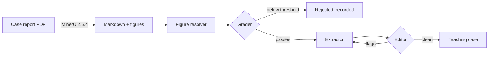

# Medical VLM Data Curator

Curates medical visual-reasoning training data from published case reports, using a LangGraph pipeline with an LLM grader, extractor and editor. Each case report becomes a teaching case — *case prompt → diagnostic reasoning → final diagnosis* — with its relevant figures attached. The flow is improvised from [MedCaseReasoning](https://arxiv.org/abs/2505.11733) (Wu et al., 2025); see [Source and attribution](#source-and-attribution).

> **Status: rebuild in progress.** A working prototype produced 51 teaching cases and lives in
> [`notebooks/archive/`](notebooks/archive/). `src/curator/` is being built out from it.

---

## Pipeline



| Stage | Does | Where it lives |
|---|---|---|
| **Extraction** | PDF → markdown + figures (MinerU, needs a GPU) | [`01_pdf_extraction_mineru.ipynb`](notebooks/archive/01_pdf_extraction_mineru.ipynb) |
| **Curation** | grade → extract → audit → refine loop | [`02_curation_loop_python.ipynb`](notebooks/archive/02_curation_loop_python.ipynb) (plain Python), [`03_curation_loop_langgraph.ipynb`](notebooks/archive/03_curation_loop_langgraph.ipynb) (LangGraph) |
| **Evaluation** | judge calibration against human labels | planned |

## Data governance

**The source corpus is copyrighted and is not distributed here.** It derives from *Clinical
Cases in Tropical Medicine* (Elsevier, 2022). This repository contains code only. It does not
contain — and `.gitignore` actively blocks — case report PDFs, extracted text, extracted
figures, generated teaching cases, or human labels that quote source text.

## Setup

Requires Python ≥ 3.11.

```bash
git clone https://github.com/phuclhp1922/Medical_Data_Extractor.git
cd Medical_Data_Extractor
python -m venv .venv
```

Activate the virtual environment (run this in every new terminal):

| Shell | Command |
|---|---|
| Windows cmd | `.venv\Scripts\activate.bat` |
| Windows PowerShell | `.venv\Scripts\Activate.ps1` |
| Git Bash | `source .venv/Scripts/activate` |
| macOS / Linux | `source .venv/bin/activate` |

Then install:

```bash
pip install -e ".[dev,eval]"
```

Install the notebook filter, which strips cell outputs before they are committed:

```bash
nbstripout --install --attributes .gitattributes
```

Configure credentials:

```bash
cp .env.example .env    # then add your API key
```

### Running the extraction stage

MinerU needs a GPU, so this stage runs in Colab or Kaggle. It is not yet packaged; run
[`notebooks/archive/01_pdf_extraction_mineru.ipynb`](notebooks/archive/01_pdf_extraction_mineru.ipynb).
The corpus was produced with **MinerU 2.5.4, `pipeline` backend**.

### Tests

With the virtual environment activated:

```bash
python -m pytest
```

## Layout

Entries marked • are planned, not yet written.

```
src/curator/
  config.py         settings and grading thresholds
  figures.py        deterministic figure resolver
  prompts/          grader / extractor / editor prompts
• extract.py        MinerU wrapper
• parsing.py        structured-output parsing
• graph.py          LangGraph state machine
• nodes.py          load / grade / extract / review
• run.py            CLI
• eval/             sampling, blind labelling, agreement statistics
tests/              unit tests
notebooks/archive/  the original prototype, outputs stripped
• reports/          plots and aggregate metrics
```

## Source and attribution

The curation flow and prompts is adapted from **MedCaseReasoning** (Wu et al., 2025,
[arXiv:2505.11733](https://arxiv.org/abs/2505.11733)): grading case reports against
clinician-developed criteria, extracting a case prompt, diagnostic reasoning and final
diagnosis, then checking the result for faithfulness with a separate LLM. This project adds
figure resolution and an editor → extractor refinement loop.

```bibtex
@article{wu2025medcasereasoning,
  title   = {MedCaseReasoning: Evaluating and learning diagnostic reasoning from clinical case reports},
  author  = {Wu, Kevin and Wu, Eric and Thapa, Rahul and Wei, Kevin and Zhang, Angela and Suresh, Arvind and Tao, Jacqueline J. and Sun, Min Woo and Lozano, Alejandro and Zou, James},
  journal = {arXiv preprint arXiv:2505.11733},
  year    = {2025}
}
```

Case reports: *Clinical Cases in Tropical Medicine*, Elsevier, 2022. Used for research; not
redistributed. PDF extraction by [MinerU](https://github.com/opendatalab/MinerU). Orchestration
by [LangGraph](https://github.com/langchain-ai/langgraph).

Code is MIT licensed. The dataset it produces is not licensed for redistribution.
