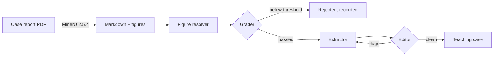

# Medical VLM Data Curator

Curates medical visual-reasoning training data from published case reports, using a
LangGraph pipeline with an LLM grader and an LLM editor — and, more to the point, tries to
find out whether those LLM judges are worth anything.

> **Status: rebuild in progress.** A working prototype produced 51 teaching cases and lives in
> [`notebooks/archive/`](notebooks/archive/). `src/curator/` is being built out from it.
> **No calibration number exists yet** — producing one is the point of the current work.
> The plan is [`PLAN.md`](PLAN.md).

---

## The problem

Turning a published case report into a teaching case — *case prompt → diagnostic reasoning →
final diagnosis*, with the relevant figures attached — is easy to do badly and hard to verify.
The obvious approach is to have one LLM extract and another LLM check the extraction.

The obvious approach is also where the interesting question lives: **how do you know the
checker works?** "An LLM judged it" is not a quality claim. This repo is an attempt to turn it
into one, by calibrating the judge against human labels and reporting the agreement statistic
whatever it turns out to be.

## Pipeline



Three stages, currently in three notebooks, being consolidated into one package:

| Stage | Does | Where it runs |
|---|---|---|
| **Extraction** | PDF → markdown + figures (MinerU) | Colab / Kaggle — needs a GPU |
| **Curation** | grade → extract → audit → refine loop (LangGraph) | anywhere |
| **Evaluation** | judge calibration against human labels | anywhere |

## What has been measured

These come from the prototype's saved run outputs, re-verified against the corpus. They are
findings about *this pipeline*, not benchmark claims.

**The judge does not currently discriminate.** Across 51 extracted cases, the editor raised
flags on **0**. The refine loop has therefore never executed in production. Two causes are
confounded, and separating them is the next experiment: the editor was auditing against an
empty rubric (a real bug), *and* it was running on a 27B model the project was pushed onto by
a free-tier quota change — a model class that tends to agree rather than critique.

**The yield, honestly reported.** "93 cases" is an input count, not a result:

| Stage | N |
|---|---|
| Case reports in corpus | 93 |
| Produced a parseable grading | 85 |
| Passed the quality gate (all criteria ≥ 4) | 52 |
| Reached extraction | 51 |
| Passed editorial review | 51 / 51 |

No case in the corpus scores 5 across all criteria, so the grader's effective range is 3–4 —
range restriction that will depress any agreement statistic computed later. Worth knowing
before computing it rather than after.

**Figure resolution is now deterministic and tested.** Figures must be bound to the cases that
cite them. Two independent methods, scored against 118 verified figure→file pairs:

| Method | Correct |
|---|---|
| Positional (reading order in MinerU's `_content_list.json`) | 118 / 118 |
| Caption regex + chapter guard | 96 / 118 |
| Disagreements where both methods fire | **0** |

The chapter guard matters: one case's figure caption contains a cross-reference to a figure in
a different chapter, and naive first-match-wins mislabels it.

## Data governance

**The source corpus is copyrighted and is not distributed here.** It derives from *Clinical
Cases in Tropical Medicine* (Elsevier, 2022). This repository contains code, aggregate
metrics, and plots. It does not contain — and `.gitignore` actively blocks — case report PDFs,
extracted text, extracted figures, generated teaching cases, or human labels that quote source
text.

Two practices worth copying if you fork this:

- **Notebook outputs are stripped, not just ignored.** `.gitignore` cannot help you when the
  data is embedded in a notebook's saved cell outputs. The prototype notebook carried ~199 KB
  of generated clinical text that way. An `nbstripout` filter removes it at `git add` time.
- **Figure ground truth is stored as labels and content hashes only** — never the image bytes
  or surrounding prose — so the test fixture is safe to publish.

Provenance and licensing detail will live in `DATASHEET.md`, following
[Datasheets for Datasets](https://arxiv.org/abs/1803.09010).

## Setup

Requires Python ≥ 3.11.

```bash
git clone https://github.com/phuclhp1922/medical-vlm-curator.git
cd medical-vlm-curator
python -m venv .venv
source .venv/Scripts/activate      # macOS/Linux: source .venv/bin/activate
pip install -e ".[dev,eval]"
```

**Then install the notebook filter — this step is not optional and is not automatic:**

```bash
nbstripout --install --attributes .gitattributes
```

`.gitattributes` is committed, but the filter itself is wired into `.git/config`, which is not.
A fresh clone therefore has the *intent* to strip notebook outputs and none of the *mechanism*.
Skip this and the next notebook you commit may carry clinical text into public history.

Configure credentials:

```bash
cp .env.example .env    # then add your API key
```

### Running the extraction stage

MinerU needs a GPU, so this stage runs in Colab or Kaggle. The notebook is a thin driver — all
logic lives in `curator.extract`:

```python
!pip install -q "medical-vlm-curator[extract] @ git+https://github.com/phuclhp1922/medical-vlm-curator.git"
!python -m curator.extract --pdf-dir <your-pdfs> --out-dir ./processed --backend pipeline
```

The corpus was produced with **MinerU 2.5.4, `pipeline` backend**. Both are pinned
deliberately: the defaults changed in later releases, and a different backend produces
different markdown. Your PDFs stay in your own Drive or a private Kaggle Dataset — they never
enter this repo.

### Tests

```bash
pytest                  # excludes tests that cost API tokens
pytest -m corpus        # requires a local MinerU corpus (not redistributable)
pytest -m live          # hits a real LLM API and costs money
```

## Layout

Files marked • are planned, not yet written — see the roadmap below.

```
src/curator/
• extract.py      MinerU wrapper (CLI subprocess, testable without a GPU)
• figures.py      deterministic figure resolver
• parsing.py      tolerant structured-output parsing
  prompts/        grader / extractor / editor — rules split from inputs
• graph.py        LangGraph state machine
• nodes.py        load / grade / extract / review
• run.py          CLI
• eval/           sampling, blind labelling, agreement statistics
• tests/fixtures/ figure ground truth (labels + hashes only)
notebooks/archive/  the original prototype, outputs stripped
reports/          committed plots and metrics — aggregate only, safe to publish
```

## Roadmap

[`PLAN.md`](PLAN.md) is the working plan: verified bugs with measurements, the calibration
design, cost estimates, and a reading list. Priority order:

1. Deterministic figure resolver, tested against recovered ground truth
2. Correctness fixes — retry cap, rubric wiring, schema-enforced parsing
3. **Judge calibration** — blind human labels, quadratic-weighted κ, an independent judge model
4. Error taxonomy and self-consistency sampling

## Source and attribution

Case reports: *Clinical Cases in Tropical Medicine*, Elsevier, 2022. Used for research; not
redistributed. PDF extraction by [MinerU](https://github.com/opendatalab/MinerU).
Orchestration by [LangGraph](https://github.com/langchain-ai/langgraph). The evaluation design
draws on MT-Bench (Zheng et al., 2023) for judge bias, G-Eval (Liu et al., 2023) for rubric
scoring, and LLaVA-Med (Li et al., 2023) for figure–caption grounding.

Code is MIT licensed. The dataset it produces is not licensed for redistribution.
